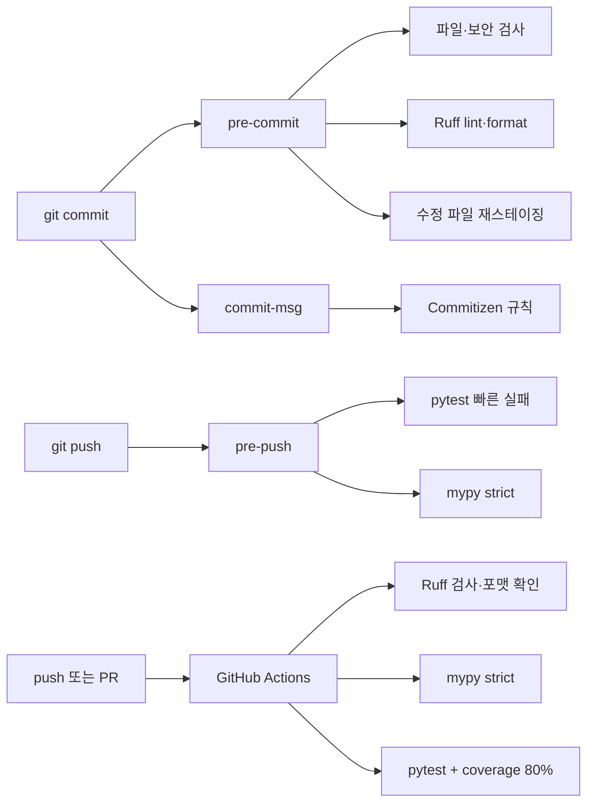

# Python Project Quality Template

[](https://github.com/bigmooon/python-template/actions/workflows/ci.yml)


새 Python 프로젝트를 시작할 때마다 린터, 포매터, 타입 검사, 테스트, 커밋 규칙과 CI를 다시 연결하지 않도록 만든 **Python 3.12 프로젝트 템플릿**입니다.

커밋 전에는 변경 파일을 빠르게 확인하고, 푸시 전에는 테스트와 타입 검사를 실행하며, GitHub Actions에서는 자동 수정 없이 전체 품질 기준을 다시 검증합니다.

## 프로젝트 개요

| 항목 | 내용 |
|---|---|
| 목적 | Python 프로젝트의 초기 품질 도구와 Git 워크플로를 재사용 가능한 형태로 표준화 |
| 대상 | 개인 프로젝트와 소규모 팀 프로젝트를 빠르게 시작하려는 Python 개발자 |
| 실행 환경 | Python 3.12, Git, Make, POSIX 환경(macOS/Linux) |
| 핵심 도구 | Ruff, mypy, pytest, coverage, pre-commit, Commitizen, GitHub Actions |
| 품질 기준 | Ruff 검사·포맷, mypy strict, 테스트 통과, 커버리지 80% 이상 |
| 초기화 방식 | `make init NAME=<package_name>`으로 패키지명과 프로젝트 메타데이터 치환 |

## 해결하려는 문제

프로젝트 초기에 품질 도구를 각각 설치하면 다음 문제가 반복됩니다.

- 로컬 검사와 CI 명령이 달라 같은 코드가 한쪽에서만 실패함
- 린트·타입·테스트 오류를 PR이나 배포 직전에 발견함
- 자동 수정 과정에서 의도하지 않은 파일까지 함께 스테이징할 수 있음
- 커밋 메시지 형식과 버전 증가 기준이 사람마다 달라짐
- 새 저장소를 만들 때 설정 파일과 명령어를 매번 다시 작성함

이 템플릿은 검사 시점을 `commit → push → CI` 세 단계로 나누고, 설정과 실행 명령을 저장소 안에 함께 제공합니다.

## 핵심 기능

| 영역 | 동작 | 도구 |
|---|---|---|
| 린트·포맷 | Python 안티패턴 검사, import 정렬, 자동 수정, 포맷 검사 | Ruff |
| 타입 안정성 | 소스 패키지 전체를 strict 모드로 검사 | mypy |
| 테스트 | smoke test 제공, CI에서 branch coverage 80% 기준 적용 | pytest, coverage |
| 파일 안전성 | 문법 오류, 충돌 마커, 디버그 구문, private key·AWS 자격증명 검사 | pre-commit hooks |
| 변경 크기 | 새로 추가한 1MB 초과 파일 차단 | pre-commit hooks |
| 커밋 규칙 | Conventional Commits 형식 검사와 버전 증가 | Commitizen |
| 자동화 | 로컬과 동일한 품질 검사를 push와 PR에서 재실행 | GitHub Actions |
| 프로젝트 초기화 | 패키지명·배포명·테스트·안내 문서 플레이스홀더 치환 | Python script, Make |

## 품질 게이트 구조



### 단계별 책임

| 단계 | 목적 | 검사 범위 |
|---|---|---|
| pre-commit | 수초 안에 수정 가능한 문제 발견 | staged 파일, 파일 무결성, 보안 패턴, Ruff |
| commit-msg | 커밋 기록의 일관성 유지 | Conventional Commits 형식 |
| pre-push | 원격 전송 전 프로젝트 단위 회귀 확인 | 빠른 pytest, mypy |
| CI | 로컬 훅 우회 여부와 관계없이 최종 재검증 | Ruff, mypy, pytest, coverage gate |

> GitHub Actions는 검사를 수행하지만, 실패한 코드의 `main` 병합을 실제로 차단하려면 저장소에서 branch protection과 required status check를 별도로 설정해야 합니다.

## 설계 선택과 이유

### 빠른 검사는 앞에, 무거운 검사는 뒤에

커밋 단계에는 변경 파일 중심의 검사만 배치하고, 프로젝트 전체 테스트와 타입 검사는 push 단계에서 실행합니다. 커버리지 계산은 CI에만 두어 일상적인 커밋과 푸시의 대기 시간을 줄였습니다.

### 로컬에서는 수정하고 CI에서는 검증만 수행

로컬 `make lint`와 pre-commit의 Ruff는 수정 가능한 문제를 자동으로 고칩니다. 반면 `make ci-check`는 `--no-fix`와 `format --check`를 사용해 CI가 코드를 바꾸지 않고 실패 원인만 보고하도록 구성했습니다.

### 자동 수정 뒤에는 한 번 멈춤

Ruff가 staged 파일을 수정하면 첫 커밋은 실패합니다. `stage_fixes.py`는 pre-commit이 전달한 목록과 실제 staged 파일의 교집합만 다시 스테이징하고, 사용자는 변경 내용을 확인한 뒤 같은 커밋을 다시 실행합니다. `--all-files` 검사에서 작업 중인 다른 파일이 함께 추가되지 않도록 했습니다.

```bash
git commit -m "feat: add parser"
# Ruff가 코드를 수정하면 커밋 중단

git diff --cached
git commit -m "feat: add parser"
```

### 도구 버전 드리프트 방지

패키지 의존성의 `ruff==0.8.4`와 pre-commit hook의 `rev: v0.8.4`를 맞춰 로컬 직접 실행과 Git hook의 결과 차이를 줄였습니다. GitHub Actions는 `make ci-check`를 호출해 저장소에 정의된 명령을 그대로 사용합니다.

## 검증 결과

2026-10-10에 Python 3.12.12 환경에서 `make ci-check`를 실행해 다음 결과를 확인했습니다.

| 검사 | 결과 |
|---|:---:|
| Ruff lint | 통과 |
| Ruff format | 4개 Python 파일 통과 |
| mypy strict | 1개 소스 파일, 오류 0건 |
| pytest | 2개 테스트 통과 |
| branch coverage | 기준선 코드 100% |
| coverage gate | 요구 기준 80% 통과 |
| pre-commit | 파일·보안·Ruff·재스테이징 hook 통과 |
| pre-push | 빠른 pytest와 mypy hook 통과 |

현재 100%는 템플릿에 포함된 3개 실행 구문의 기준선 결과입니다. 이 템플릿으로 만든 프로젝트의 향후 커버리지를 보장하는 수치가 아닙니다.

최근 `main` CI 실행 결과는 [GitHub Actions](https://github.com/bigmooon/python-template/actions/workflows/ci.yml)에서 확인할 수 있습니다.

## 빠른 시작

### 1. 요구사항

- Python 3.12 (`python3.12` 명령으로 실행 가능해야 함)
- Git
- Make와 POSIX shell(macOS 또는 Linux)

Makefile과 pre-commit 환경은 `python3.12` 실행 파일을 기준으로 구성되어 있습니다.

### 2. 저장소 복제 및 프로젝트 초기화

```bash
git clone https://github.com/bigmooon/python-template.git my-project
cd my-project

# snake_case 패키지명 사용
make init NAME=my_project
```

`make init`은 다음 작업을 수행합니다.

1. 입력값을 Python 패키지용 `snake_case`로 검증
2. 배포 이름을 `kebab-case`로 변환
3. `src/your_project/`를 새 패키지명으로 이동
4. `pyproject.toml`, smoke test, 프로젝트 안내 문서의 플레이스홀더 치환

### 3. 개발 환경 설치

```bash
make install-dev
```

이 명령은 `.venv`를 만들고 개발 의존성과 `pre-commit`, `commit-msg`, `pre-push` 훅을 설치합니다.

### 4. 설치 결과 검증

```bash
make ci-check
```

## 일상적인 사용 흐름

```bash
# 코드 작성 후 로컬 전체 검증
make validate

# Conventional Commit 작성
git add src tests
git commit -m "feat(parser): add contract parser"

# pytest와 mypy가 자동 실행됨
git push
```

필요하면 대화형 Commitizen 명령을 사용할 수 있습니다.

```bash
make commit
```

## 주요 명령어

| 명령어 | 설명 |
|---|---|
| `make init NAME=my_app` | 프로젝트·패키지명 초기화 |
| `make install-dev` | 가상환경, 개발 의존성, Git hook 설치 |
| `make lint` | Ruff 검사와 자동 수정 |
| `make format` | Ruff 포매팅 적용 |
| `make test` | pytest와 coverage 실행 |
| `make typecheck` | mypy strict 검사 |
| `make validate` | lint, format, test, typecheck 전체 실행 |
| `make quick-check` | pre-commit 단계 시뮬레이션 |
| `make full-check` | pre-commit과 pre-push 단계 시뮬레이션 |
| `make ci-check` | 자동 수정 없는 CI 검사와 80% coverage gate |
| `make commit` | Commitizen 대화형 커밋 |
| `make bump-version` | Conventional Commit 기반 버전 증가와 태그 생성 |
| `make update-hooks` | pre-commit hook 버전 업데이트 |
| `make clean` | Python·검사 도구 캐시 삭제 |

## Conventional Commits

허용하는 커밋 타입은 다음과 같습니다.

| 타입 | 용도 |
|---|---|
| `feat` | 기능 추가 |
| `fix` | 버그 수정 |
| `docs` | 문서 변경 |
| `refactor` | 동작 변경 없는 구조 개선 |
| `perf` | 성능 개선 |
| `chore` | 설정·유지보수 작업 |
| `revert` | 기존 변경 되돌리기 |

```text
feat(auth): add login endpoint
fix(parser): handle empty input
docs: update quick start
feat!: change public API
```

Commitizen 설정상 `feat`는 MINOR, `fix`와 `perf`는 PATCH 증가에 사용됩니다. 호환성을 깨는 변경은 `!` 문법으로 표시합니다.

## 저장소 구조

```text
.
├── .github/workflows/ci.yml    # push·PR 품질 검사
├── .pre-commit-config.yaml     # pre-commit·commit-msg·pre-push hook
├── scripts/
│   ├── init_project.py         # 프로젝트명 초기화
│   └── stage_fixes.py          # 자동 수정 파일 재스테이징
├── src/your_project/           # 교체될 Python 패키지
├── tests/                      # smoke test
├── Makefile                    # 개발 명령 진입점
└── pyproject.toml              # 패키지와 도구 설정
```

## 설정 변경 시 확인할 점

- Ruff를 올릴 때 `pyproject.toml`과 `.pre-commit-config.yaml`의 버전을 함께 변경합니다.
- 커버리지 기준은 `pyproject.toml`의 `[tool.coverage.report]`에서 조정합니다.
- 새 검사 명령을 추가하면 Makefile과 GitHub Actions 실행 흐름이 같은지 확인합니다.
- pre-push가 느려지면 느린 테스트를 별도 marker로 분리하고 빠른 회귀 테스트만 유지합니다.
- 로컬 hook은 `--no-verify`로 우회할 수 있으므로 중요한 저장소에서는 CI를 required check로 설정합니다.

## 현재 범위와 제약

- Makefile과 `.venv/bin` 경로를 사용하므로 기본 지원 환경은 macOS와 Linux입니다.
- Python 3.12가 기본 검증 버전이며, 다른 버전은 별도 호환성 검증이 필요합니다.
- secret 검사는 private key와 AWS 자격증명 패턴을 확인하지만 전문 secret scanner를 대체하지 않습니다.
- 포함된 smoke test와 100% 기준선 커버리지는 실제 애플리케이션 품질을 의미하지 않습니다.
- GitHub 저장소는 현재 GitHub의 “Template repository” 옵션이 활성화되지 않아 `git clone` 방식으로 사용합니다.

## 로드맵

- [x] Ruff lint·format 자동화
- [x] mypy strict와 pytest coverage gate
- [x] pre-commit·commit-msg·pre-push 분리
- [x] GitHub Actions CI
- [x] 패키지명 초기화 스크립트
- [ ] 초기화 스크립트 단위 테스트 확대
- [ ] Linux·macOS 설치 검증 자동화
- [ ] Windows 지원 방식 결정
- [ ] GitHub Template repository 옵션 활성화
- [ ] `LICENSE` 파일 추가

## License

`pyproject.toml` 메타데이터에는 MIT로 선언되어 있습니다. 재사용 조건을 명확히 하려면 별도의 `LICENSE` 파일을 추가해야 합니다.
