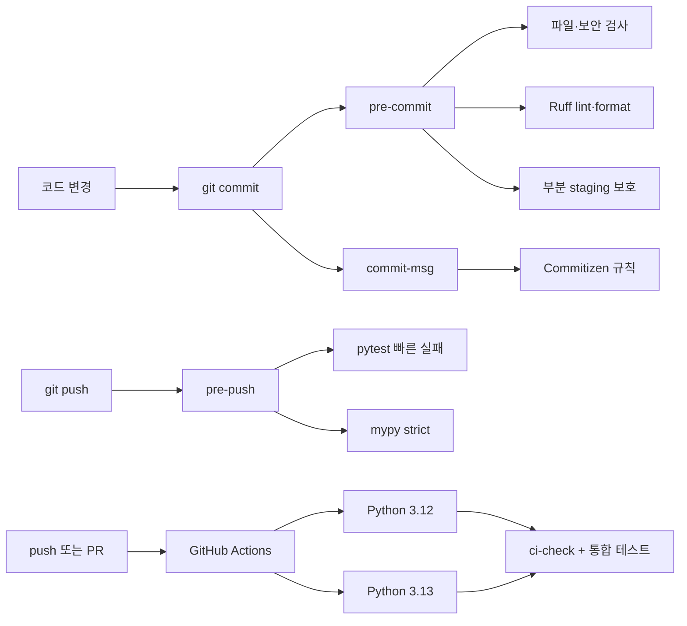

# Python Project Quality Template

[](https://github.com/bigmooon/python-template/actions/workflows/ci.yml)


Python 프로젝트를 시작할 때마다 품질 도구와 Git workflow를 다시 조립하지 않도록 만든 **Python 3.12–3.13 프로젝트 템플릿**입니다.

프로젝트명 초기화부터 lint, format, type check, test, coverage, commit 규칙과 CI까지 하나의 Make workflow로 연결합니다. 템플릿 자체도 단위 테스트와 실제 초기화 통합 테스트로 검증합니다.

## 프로젝트 개요

| 항목 | 내용 |
|---|---|
| 목적 | Python 프로젝트의 초기 구조와 품질 기준을 반복해서 설정하는 비용 절감 |
| 대상 | 개인 프로젝트와 소규모 팀 프로젝트를 빠르게 시작하려는 Python 개발자 |
| 지원 버전 | Python `>=3.12,<3.14`; CI에서 3.12·3.13 검증 |
| 지원 환경 | macOS·Linux, Make, POSIX shell |
| 핵심 도구 | Ruff, mypy, pytest, coverage, pre-commit, Commitizen |
| 자동화 | Git hook, GitHub Actions, Dependabot, 개발 의존성 constraints |
| 품질 기준 | Ruff·mypy strict·테스트 통과, branch coverage 80% 이상 |

## 해결하려는 문제

새 프로젝트마다 lint, format, type check와 test 설정을 따로 구성하면 다음 문제가 반복됩니다.

- 로컬과 CI의 명령·도구 버전이 달라 같은 코드가 한쪽에서만 실패함
- 오류를 commit이나 push 이후에 발견해 수정 비용이 커짐
- 자동 포맷 과정에서 부분 staging한 변경이 의도치 않게 섞일 수 있음
- 템플릿 초기화는 성공했지만 이름이 남거나 기본 테스트가 깨질 수 있음
- 최소 버전 의존성만 선언하면 설치 시점에 따라 개발 환경이 달라짐

이 저장소는 검사를 `commit → push → CI`로 나누고, 프로젝트 생성 과정 자체까지 테스트 대상으로 포함합니다.

## 핵심 기능

| 영역 | 구현 내용 |
|---|---|
| 프로젝트 초기화 | `snake_case` import 이름과 `kebab-case` 배포 이름 생성, 패키지·설정·테스트·문서 일괄 치환 |
| 코드 품질 | `src`, `tests`, `scripts`를 Ruff로 검사하고 포맷 |
| 타입 안정성 | `src`, `scripts`에 mypy strict 적용 |
| 테스트 | 초기화·이름 검증·충돌 처리·부분 staging 보호 단위 테스트 |
| 통합 검증 | 임시 Git 저장소에서 `init → install-dev → ci-check` 전체 workflow 실행 |
| 커버리지 | `src`와 `scripts`의 branch coverage 80% gate |
| Git workflow | pre-commit, commit-msg, pre-push 단계별 검사 |
| 의존성 관리 | universal constraints 파일과 Dependabot 주간 업데이트 |
| 원격 검증 | Python 3.12·3.13 matrix, 읽기 전용 token, Ubuntu 24.04 runner |

## 품질 게이트 구조



### 단계별 책임

| 단계 | 목적 | 실행 내용 |
|---|---|---|
| pre-commit | 빠르게 수정 가능한 문제를 commit 전에 발견 | 파일 무결성, 보안 패턴, 대용량 파일, Ruff |
| commit-msg | 변경 이력을 일정한 형식으로 유지 | Conventional Commits 검증 |
| pre-push | 원격 전송 전 회귀 오류 확인 | 빠른 pytest, mypy strict |
| CI | 독립 환경에서 전체 품질 기준 재검증 | Ruff, mypy, 단위 테스트, coverage, 초기화 통합 테스트 |

## 주요 설계 결정

### 빠른 검사는 앞에, 무거운 검사는 뒤에

commit 단계에는 변경 파일 중심의 검사만 실행합니다. 프로젝트 전체 테스트와 타입 검사는 push 단계로 보내고, 의존성 설치를 포함하는 초기화 통합 테스트는 CI에서 수행합니다. 검사의 깊이는 유지하면서 일상적인 feedback 시간은 짧게 가져가기 위한 구성입니다.

### 자동 수정 hook이 Git index를 바꾸지 않음

부분 staging 상태에서 hook이 `git add`를 실행하면 pre-commit이 임시로 숨긴 unstaged hunk와 충돌할 수 있습니다. `stage_fixes.py`는 Ruff가 staged 파일을 수정했을 때 commit을 중단하고 검토할 파일만 안내합니다.

```bash
git diff
git diff --cached
git add -p
git commit -m "feat: add parser"
```

같은 줄에 staged·unstaged 변경이 공존하는 상황도 실제 Git 저장소를 생성해 검증합니다. 테스트는 hook이 실패하면서도 index와 worktree의 변경을 각각 그대로 보존하는지 확인합니다.

### 템플릿도 하나의 제품으로 테스트

설정 파일이 존재하는지만 검사하지 않습니다. 통합 테스트가 저장소를 임시 디렉터리에 복사하고 다음 사용자 흐름을 직접 실행합니다.

```text
프로젝트 복사 → Git 초기화 → 이름 치환 → 개발 환경 설치
→ 정적 검사와 단위 테스트 → 부분 staging 충돌 검증
```

### CLI와 Git hook 버전을 함께 관리

Ruff와 Commitizen은 `pyproject.toml`의 CLI 버전과 `.pre-commit-config.yaml`의 hook revision을 동일하게 유지합니다. 로컬 직접 실행과 hook의 결과가 달라지는 version drift를 줄이기 위한 선택입니다.

### 재현 가능한 개발 환경

`requirements-dev.lock`은 Python 3.12–3.13과 주요 플랫폼을 위한 universal constraints 파일입니다. 설치에는 pip를 사용하고 lock 재생성에만 uv를 사용해, 일반 사용자의 필수 도구를 늘리지 않으면서 의존성 해석 결과를 고정합니다.

## 검증 결과

2026-10-10, macOS와 Python 3.12.12 환경에서 직접 다시 실행한 결과입니다.

| 검증 항목 | 결과 |
|---|:---:|
| Ruff lint·format | Python 파일 9개 통과 |
| mypy strict | 소스·스크립트 3개 파일, 오류 0건 |
| 단위 테스트 | 17개 통과 |
| 초기화 통합 테스트 | 1개 통과 |
| branch coverage | 85.39% |
| coverage gate | 기준 80% 통과 |
| pre-commit·pre-push | 전체 hook 통과 |
| GitHub Actions | Python 3.12·3.13 matrix 통과 |

최신 원격 검증 결과는 [GitHub Actions](https://github.com/bigmooon/python-template/actions/workflows/ci.yml)에서 확인할 수 있습니다.

> 85.39%는 템플릿의 초기화·hook 스크립트와 기본 패키지에 대한 현재 측정값입니다. 이 템플릿으로 생성한 애플리케이션의 품질이나 향후 커버리지를 보장하지 않습니다.

## 빠른 시작

### 1. 요구사항

- Python 3.12 또는 3.13
- Git
- Make와 POSIX shell(macOS 또는 Linux)

`python3`가 지원 버전을 가리켜야 합니다. Makefile과 pre-commit hook은 이 실행 환경을 공통으로 사용합니다.

### 2. 복제 및 초기화

```bash
git clone https://github.com/bigmooon/python-template.git my-project
cd my-project

make init NAME=my_project
```

`NAME`은 Python package에 사용할 `snake_case` 형식을 권장합니다. `make init`은 다음 항목을 변경합니다.

1. `src/your_project/`를 새 package 이름으로 이동
2. 배포 이름을 `kebab-case`, import 이름을 `snake_case`로 변환
3. `pyproject.toml`, test, README, Makefile, lock 파일의 placeholder 치환
4. 기존 대상 package와 충돌하면 덮어쓰지 않고 종료

### 3. 개발 환경 설치

```bash
make install-dev
```

`.venv`와 고정된 개발 의존성을 준비하고 pre-commit, commit-msg, pre-push hook을 설치합니다.

### 4. 설치 검증

```bash
make ci-check
make test-integration
```

`make test-integration`은 새로운 임시 환경에 의존성을 다시 설치하므로 네트워크 연결이 필요하고 일반 단위 테스트보다 오래 걸립니다.

## 일상적인 개발 흐름

```bash
# 코드 작성 후 전체 로컬 검증
make validate

# Conventional Commit 작성
git add src tests
git commit -m "feat(parser): add config parser"

# pre-push에서 pytest와 mypy 실행
git push
```

대화형 Commitizen을 사용하려면 다음 명령을 실행합니다.

```bash
make commit
```

## Make 명령어

| 명령어 | 설명 |
|---|---|
| `make init NAME=my_app` | 프로젝트·package 이름 초기화 |
| `make install-dev` | 가상환경, 고정 개발 의존성, Git hook 설치 |
| `make lint` | Ruff 검사와 자동 수정 |
| `make format` | Ruff format 적용 |
| `make typecheck` | `src`, `scripts` mypy strict 검사 |
| `make test` | 단위 테스트와 branch coverage 80% gate |
| `make test-integration` | 초기화부터 품질 검사까지 end-to-end 검증 |
| `make validate` | lint, format, test, typecheck 실행 |
| `make quick-check` | pre-commit 단계 simulation |
| `make full-check` | pre-commit·pre-push 단계 simulation |
| `make ci-check` | 자동 수정 없는 전체 CI 검사 |
| `make commit` | Commitizen 대화형 commit |
| `make bump-version` | Conventional Commit 기반 version 증가와 tag 생성 |
| `make lock-dev` | uv로 개발 constraints 재생성 |
| `make update-hooks` | pre-commit repository revision 업데이트 |
| `make clean` | Python·검사 도구 cache 제거 |

## Conventional Commits

```text
feat(auth): add login endpoint
fix(parser): handle empty input
docs: update quick start
feat!: change public API
```

허용 타입은 `feat`, `fix`, `docs`, `refactor`, `chore`, `revert`, `perf`입니다. Commitizen 설정상 `feat`는 MINOR, `fix`와 `perf`는 PATCH version 증가에 사용되며 호환성을 깨는 변경은 `!`로 표시합니다.

## 의존성 업데이트

Dependabot이 매주 pip과 GitHub Actions 업데이트를 확인합니다. 개발 의존성을 변경한 뒤에는 constraints와 품질 검사를 함께 갱신합니다.

```bash
make lock-dev
make install-dev
make ci-check
make test-integration
```

`make lock-dev`에만 [uv](https://docs.astral.sh/uv/)가 필요합니다. Ruff와 Commitizen을 변경할 때는 CLI dependency와 pre-commit hook revision을 같은 버전으로 맞춥니다.

## 저장소 구조

```text
.
├── .github/
│   ├── dependabot.yml              # 의존성 자동 업데이트
│   └── workflows/ci.yml            # Python 3.12·3.13 matrix CI
├── scripts/
│   ├── init_project.py             # 프로젝트 이름 초기화
│   └── stage_fixes.py              # 안전한 자동 수정 검토 안내
├── src/your_project/               # 초기화 시 변경되는 package
├── tests/
│   ├── test_init_project.py        # 초기화 단위 테스트
│   ├── test_stage_fixes.py         # 부분 staging 보호 테스트
│   ├── test_template_integration.py # 사용자 workflow 통합 테스트
│   └── test_smoke.py               # package 기준선 테스트
├── LICENSE
├── Makefile                        # 개발 명령 진입점
├── pyproject.toml                  # package·도구 설정
└── requirements-dev.lock           # 개발 의존성 constraints
```

## 현재 범위와 GitHub 설정

- 기본 지원 환경은 macOS와 Linux입니다. Windows는 현재 지원 범위에 포함하지 않습니다.
- secret 검사는 private key와 AWS credential pattern을 확인하지만 전문 secret scanner를 대체하지 않습니다.
- 통합 테스트는 의존성을 새로 설치하므로 오프라인 환경에서는 실행할 수 없습니다.
- GitHub Actions는 검사를 실행하지만 `main` 병합을 실제로 차단하려면 branch ruleset에서 required check를 설정해야 합니다.
- 현재 저장소는 GitHub의 **Template repository** 옵션이 비활성화되어 있어 `git clone` 방식으로 사용합니다.

저장소 관리자는 GitHub Settings에서 다음 항목을 별도로 적용할 수 있습니다.

1. Template repository 활성화
2. `main` 변경 시 PR 필수
3. force push와 branch 삭제 제한
4. `Python 3.12`, `Python 3.13` CI를 required status check로 지정

## License

[MIT License](LICENSE)
